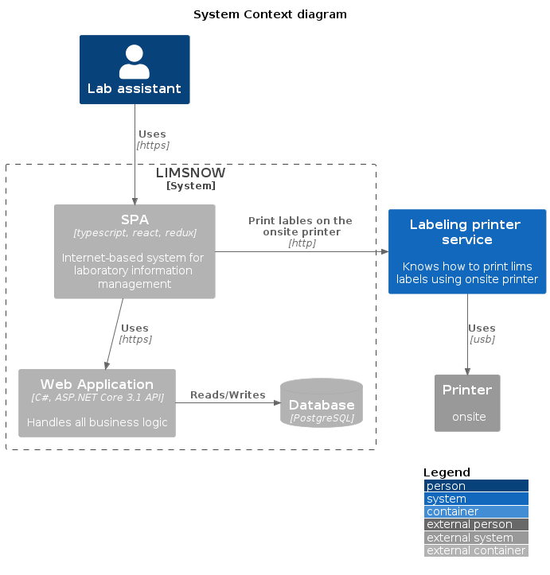
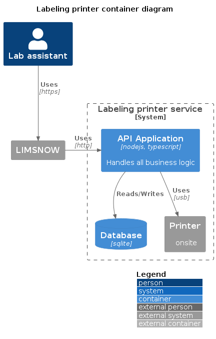
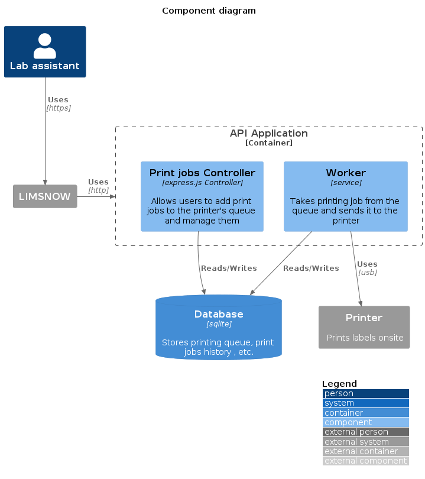

# Labeling printer

This service is responsible for printing custom labels from a LIMS on a specialized labeling printers.

A LIMS administrator via LIMS APIs can configure LIMS with known labeling-printer service IPs.

## User stories

- As a laboratory assistant I can print various labels with one click from LIMS using onsite printer.
- As a laboratory assistant I can observe my print job status.
- As a laboratory assistant I can cancel my print job, if it has not been started.
- As an administrator I can view all printing jobs.
- As an administrator I can delete a print job from the queue or history log.

## Constraints

- State of printing jobs should be persisted on system restart.
- Should be able to run on a Raspberry Pi 3 Model B.
- Supported printers: brother ql-570, brother ql-710w.
- Max 15 concurrent users per day.
- Max 250 labels printed per day.
- It is not expected the service to scale up in the next 1 year.
- The service is going to be deployed on a computer to which a supported printer is going to be attached physically.
- The service is going to be deployed in the same private network with other computers where LIMS clients are running.
- Technology stack: node.js (lts), typescript, openapi, plantuml
- For authorization a bearer token has to be used with according claims. LIMS is responsible for providing one.

## Architecture overview





## API Documentation

[openapi definition](docs/labeling-printer.0.0.oas.yaml)

## Back of the envelope calculations

TODO:

- System performance characteristics?
- Bottlenecks and resource estimations?

## Development

Make sure you have `nvm` installed. From the projects folder execute:

```sh
nvm use
npm install
```

A mock server using api definition can be started via:

```sh
npm run start:mock-api
```

To run tests:

```sh
npm test
```

## TODO

- [ ] Generate openapi static website
- [ ] Monitoring
- [ ] Metrics
- [ ] Potential improvements (add rate limiter, x docs to print per ip/user per y secs; should it be client side or server side; separate service or app code)
- [ ] Error cases (server failure, network loss, etc.)
- [ ] Operation issues (CI/CD? How to monitor metrics and error logs? How to roll out the system? How to updated it?)
- [ ] Create api design guidelines

## Running mock api

```sh
# Get empty response
curl -X 'GET' \
  'http://localhost:4010/print-jobs' \
  -H 'accept: application/json' \
  -H 'Authorization: xxx' \
  -H 'Prefer: example=empty'
# Get many responses
curl -X 'GET' \
  'http://localhost:4010/print-jobs' \
  -H 'accept: application/json' \
  -H 'Authorization: xxx' \
  -H 'Prefer: example=with-data'
```
